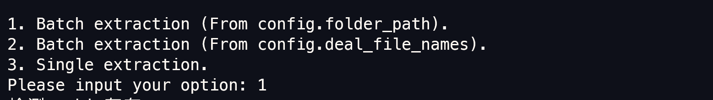
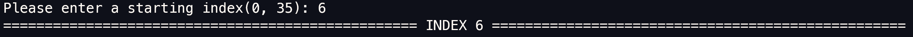

# FOFA_Extract_Fingerprint

半自动化指纹提取。

**扩充自[Fofa-script](https://github.com/Cl0udG0d/Fofa-script)**

## 主要思想

- 给定需要提取的文档，对于含有 `metadata`的文档，将 `metadata`转化为可供 `FOFA`查询的 `FOFA`查询语句。
- 以此语句查询到的结果为**基准数量**，并获取结果的网址，称为**样例网址**。
- 利用这些网址**提取特征**，现在可以进行
  - `header`
  - 图标hash
  - 首页源码中的文件
  - 首页源码中以 `#`开头的颜色
  - 首页源码中的函数
  - 首页源码中的注释
    - `<!-- -->`
    - `//`
- 若这些特征在这些样例网址中存在比例大于给定比例，则将特征转化为FOFA查询语句，并获取结果数量。
- 若**数量与基准数量**的比值在给定指纹特征可接受的范围内，则将其视为一个**新的指纹。**

## 使用方式

### 预设置

- 修改 `config.py`中的 `cookie`，  `folder_path`，`output_path`。

  - `cookie` 设置详见该仓库 [Fofa-script](https://github.com/Cl0udG0d/Fofa-script)
  - `folder_path` 需要提取文档的路径（路径中只有待提取文档）
  - `output_path` 为输出 `json`指纹的路径
  - 以上两个路径不能相同
- `config.py`中可以根据个人需求更改变量值

  - `StartPage`：**样例网址**获取的起始页面，默认值为第一页
  - `StopPage`：**样例网址**获取的终止页面，默认值为第二页
  - `TimeSleep`：**样例网址**爬取之间的Sleep时间，默认值为5s。
  - `pro_first_lower`：若特征在样例网址中存在比例该值，即比例，则将该特征转化为 `FOFA`查询语句进一步验证，默认为0.25。
  - `pro_upper`：确定为指纹的比例区间的上界，默认为1.5。
  - `pro_lower`：确定为指纹的比例区间的下界，默认为0.9。

### 运行

```powershell
python .\FOFA_Extract_Fingerprint.py
```


### 格式规定

对于待提取文档名字 `abcd.yaml`，将输出文档格式 `abcd_fingerprint.json`


### 模式选择

共有三种模式：

```python
menu = """
1. Batch extraction (From config.folder_path).
2. Batch extraction (From config.deal_file_names).
3. Single extraction."""
```



分别为：

- 批处理提取（文件名自动取自 `config.folder_path 路径下`）
  - 提取给定文件
- 批处理提取（文件名取自 `config.deal_file_names`）
  - 提取给定的文件
  - `config.deal_file_names`：以 `python` 列表格式，内容为字符串形式的文件名
- 单特征提取
  - 手动输入 `FOFA`查询条件，获取查询结果数，以此为指纹提取的参照。
  - 对于没有 `metadata`的文档，可以后续通过此选项，手动指定基准`FOFA`查询条件

### INDEX选择



- 每次运行，都将提示每个文件的索引
- 若之前进行了提取操作但是中断了，可以通过输入索引，**手动**继续程序。


## 半自动注意事项

### 已经进行过提取操作，之前提取的指纹都在 `output_path`中

- 程序将根据


### 从未进行过提取操作
